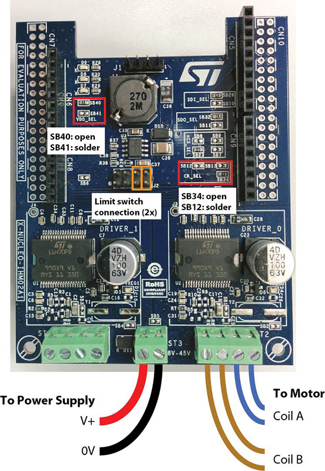

# Stepper Velocity Controller
An Arduino stepper motor controller for the X-NUCLEO-IHM02A1 stepper driver board. It accepts commands over *Serial* for (a) direct positioning of the stepper or (b) continuous tracking of a moving target.

## Setup and Installation

### Hardware
You will need:
- an Arduino Uno
- an X-NUCLEO-IHM02A1 stepper driver board
- a stepper motor
- a DC power supply with sufficient voltage and current for your motor
Before connecting the the driver board to the Arduino, you must modify a few solder jumpers on the XNucleo board, as shown in the diagram below. Next, connect the dirver to the Arduino and wire up the motor and power connections as shown in the diagram.



### Software
Download this repository and open up the `StepperVelocityController.ino` file in your Arduino software. You will need to customize several of the variable in the first few lines of the program for your particular motor and use case. These setup variables are clearly commented in the code (roughly on lines 10–50).

After you update these variables, save the code and upload the full program onto your Arduino.

## Use

Make sure the driver board is powered up. Then connect your Arduino to your PC using a USB cable. Open a 115200 baud serial connection to the Arduino (the simplest way to do this for testing is with the `Serial Monitor` in the Ardunio software.)

All Serial commands consist of a single-character command, followed by an optional numeric argument, followed by a `;` or an end-of-line character.

|Command(s)|Description|
|---|---|
|`S`, `A` | Print max speed (`S`) or acceleration rate (`A`) |
|`S`, `A` \<value\>| Set max speed (`S`) or acceleration rate (`A`) |
|`P`, `I`, `D` \<optional value\>| Set/Print *P*, *I*, and *D* gains for tracking <br /> (For now, `I` and `D` are disabled — only proportional tracking works.)|
|`X` | Stop motor |
|`Q` | Stop motor, Hi-Z mode (allows free movement of the motor) |
|`F` \<distance\>| Move forward the specified distance |
|`B`, `R` \<distance\>| Move backwards the specified distance |
|`G` \<position\>| Go to the specified position |
|`W` | Print current position ("Where am I?")|
|`Z` | Re-zero: Set current position to be 0 |
|`H` | Home: Move backwards until limit switch is triggered, then re-zero |
|**Tracking Mode** (PID Mode)||
|`T` \<position\> | Update target position for tracking |
|`E` \<error\> | Update instantaneous tracking error |
|**Troubleshooting**||
|`?` | Report motor status |
|`!` | Check for alarm flags |
|`$` | Reset motor configuration |
|`#` \<freq\>| Track a sine wave with frequency speficied in Hz (default: 1 Hz)|


NOTE: All distances, errors, and absolute positions are specified in *physical units* of your choosing (e.g., degrees, mm, pixels, etc.) which are set up in the code.

### Tracking Mode
The motor can track to a dynamically updated target position. The *Track* (`T`) and *Error* (`E`) commands are designed to be called at a regular frequency, e.g., 30 Hz, to update the internal tracking target. The motor velocity is constantly updated to track the current target position.

The `T` command directly updates target position, while the `E` command specifies the current error value (i.e., the difference between the current motor position and the new target position).

### Examples

- `G 90`: Go to the absolute position 90
- `F 220`: Move forward by 220 units
- `W`: Print current position
- `R 20; Z;` Move backwards by 20, then re-zero

#### Tracking pseudo-code
```C
// Keep a (motorized) LED centered on a moving object
// Assume camera is fixed.
while (true) {
	frame = AcquireNewCameraFrame();
	// get x position of object
	xVal = GetXPositionOfTrackedObject(frame);
	// Update LED motor's tracking target :
	SerialCommandToArduino("T <xVal>");
}
```

```C
// Motorized camera on a gantry, tracking a moving object: 
// Try to center the object in field of view (e.g., at position x=0)
targetPosition = 0;
while (true) {
	frame = AcquireNewCameraFrame();
	// get positional error
	currentPosition = GetXPositionOfTrackedObject(frame);
	error = targetPosition - currentPosition;
	// Move camera gantry to cancel error:
	SerialCommandToArduino("E <error>");
}
```


